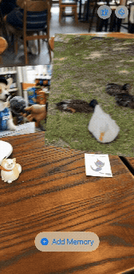

# Objects With Memories

A camera-based AR prototype that connects physical objects to personal digital memories.

Point a phone camera at a physical object. The app visually recognizes it — no QR codes, NFC tags, or other markers — and shows whatever memories (photos, videos, audio, text) are attached to that specific object, spatially anchored to it in AR.

```
Physical object → Visual recognition → Object identity → Associated memory → Spatially anchored AR content
```

The product hypothesis: people may find it meaningful to access personal memories by looking at the physical objects associated with them. The physical object is the interface — the goal is for it to feel like *"this object remembers."*

| Registering a new object | Recognizing already-registered objects |
|:---:|:---:|
|  |  |

## Status

Prototype stage. The core technical loop (recognize → identify → attach a memory → display it anchored in AR) is built and working on-device. See [`documentation/ROADMAP.md`](documentation/ROADMAP.md) for milestone-by-milestone progress and [`documentation/EXPERIMENTS.md`](documentation/EXPERIMENTS.md) for recognition stress-test data.

## Two recognition approaches, two app modes

The app was used to compare two different ways of recognizing objects, and that split is still visible in how it's organized:

- **Approach A — ARKit object scanning** (`ARReferenceObject` / `ARObjectAnchor`). Gives real 6DOF pose, but needs a multi-angle scan to register an object and turned out to be unreliable on small, low-texture, glossy, or plain-surfaced objects — see Decision 006 in [`documentation/DECISIONS.md`](documentation/DECISIONS.md).
- **Approach C — Vision embeddings** (`GenerateImageFeaturePrintRequest`). Registers from a handful of ordinary photos, proved far more reliable across the objects tested (including ones Approach A couldn't handle at all), but gives identity only — no pose.

| | Approach A — ARKit scanning | Approach C — Vision embeddings |
|---|---|---|
| Registration | Multi-angle walk-around scan | 2–5 ordinary photos |
| Spatial anchor | Full 6DOF, tracks the object | None — raycast placement, world-fixed |
| Low-texture / glossy objects | Failed outright | Recognized reliably |
| Background sensitivity | High — needs contrast against the scene | Some — same-color background can fail |
| Object moved mid-session | Stops re-detecting until app relaunch | Re-evaluates every frame, unaffected |

Full data behind this table is in [`documentation/EXPERIMENTS.md`](documentation/EXPERIMENTS.md); the resulting call is Decision 006 in `DECISIONS.md`.

Both are still in the app, behind an `ObjectRecognitionService` abstraction, so recognition technology can be swapped without touching the rest of the app:

- **Experiment mode** — the recognition-testing surface used to produce the data in `EXPERIMENTS.md`. Runs both approaches side by side for comparison.
- **Product mode** — the real, intended app experience, built on Approach C (the more reliable one). Register an object with a few photos, attach memories to it, and later point the camera at it to see them appear in AR. Since Approach C has no pose, placement uses a raycast against the detected surface at the moment of recognition instead of object tracking — see Decision 007 in `DECISIONS.md`.

The app opens to a mode picker, with a way to switch modes from within either one.

## Tech stack

- Swift, SwiftUI, Xcode
- ARKit, RealityKit (AR session, spatial anchoring, 3D content)
- Vision (`GenerateImageFeaturePrintRequest` for embedding-based recognition)
- PhotosUI, AVFoundation, AVKit (media capture and playback)
- Local storage only (`FileManager`) — no backend, auth, or cloud sync at this stage
- [XcodeGen](https://github.com/yonaskolb/XcodeGen) — the Xcode project is generated from `project.yml`, not committed

## Getting started

Requires a physical iPhone — ARKit world tracking and several RealityKit anchor APIs used here aren't available in the Simulator.

```bash
brew install xcodegen   # if you don't have it
xcodegen generate
open ObjectsWithMemories.xcodeproj
```

Build and run on a connected iPhone (iOS 18+). Grant camera access when prompted.

## Project structure

```
ObjectsWithMemories/
├── App/            # App entry point, mode routing, Experiment-mode root view
├── AR/             # AR session management (one path per recognition approach)
├── Recognition/    # ObjectRecognitionService abstraction + ARKit/embedding implementations
├── ARContent/      # Converts a Memory into RealityKit content (image/video/audio/text)
├── Models/         # RecognizedObject, Memory, RegisteredObject, etc.
├── Persistence/    # Local, file-based memory and object-registration storage
├── Features/       # Mode selection, memory creation, Product mode (register/library/edit)
└── Resources/      # Bundled reference objects, sample media
```

Architecture principles (recognition is replaceable, objects are generic, recognition stays separate from memory storage, memory stays separate from AR presentation, local-first) are documented in [`documentation/ARCHITECTURE.md`](documentation/ARCHITECTURE.md).

## Known limitations

- **No object tracking in Product mode.** Content is placed once via a raycast when the object is first recognized and stays world-fixed after that — if you move the physical object, the memory stays where it was placed instead of following it (Decision 007).
- **Approach A fails outright on small, glossy, or low-texture objects**, and gives no in-app warning at scan time — you only find out once recognition never fires.
- **Approach C accuracy is viewpoint- and background-dependent.** A same-color background or an unregistered viewing angle can misidentify an object as a different registered one; multi-angle registration photos help but don't fully eliminate this.
- **One recognized object at a time in Product mode** — no simultaneous multi-object recognition, unlike Experiment mode's ARKit path.
- **Local storage only.** No backend, cross-device sync, or backup — deleting the app deletes all registered objects and memories.
- **Recognition polls rather than runs continuously** (~0.5s interval in Product mode), so there's a brief delay before a newly-viewed object is recognized.
- **No automated test coverage** beyond a placeholder unit test — verification so far has been manual, on-device.

## Documentation

- [`documentation/ROADMAP.md`](documentation/ROADMAP.md) — milestones, goals, success criteria
- [`documentation/ARCHITECTURE.md`](documentation/ARCHITECTURE.md) — data models, service interfaces, recognition abstraction, persistence design
- [`documentation/DECISIONS.md`](documentation/DECISIONS.md) — architectural decisions and the reasoning behind them
- [`documentation/EXPERIMENTS.md`](documentation/EXPERIMENTS.md) — recognition experiments, stress-test conditions and results
